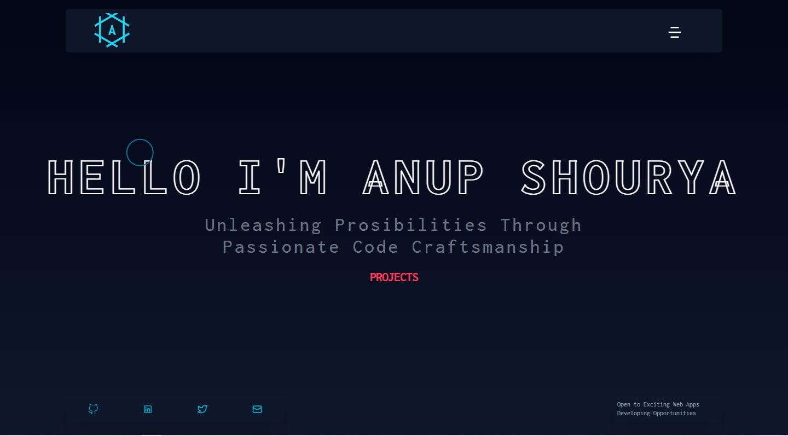

# Portfolio Website



This is my portfolio website showcasing my skills, projects, and experiences as a Full Stack Web Developer. The website is built using ReactJS, TypeScript, and various other modern web technologies.

## Table of Contents

- [Introduction](#introduction)
- [Features](#features)
- [Technologies](#technologies)
- [Installation](#installation)
- [Usage](#usage)
- [License](#license)
- [Contact](#contact)

## Introduction

As a passionate and enthusiastic Full Stack Web Developer, I take pride in crafting user-friendly and visually appealing web solutions. This portfolio website serves as a showcase of my capabilities, projects, and accomplishments.

## Features

- Clean and modern design
- Responsive layout for different devices
- Smooth animations and transitions
- Interactive components to engage users
- Detailed project showcase with descriptions and images
- Easy navigation and intuitive user interface

## Technologies

This portfolio website is built using the following technologies:

- ReactJS
- TypeScript
- SASS
- Tailwind CSS
- Framer Motion
- React Icons
- Vite (for fast development and building)

## Installation

To run the website locally, you can follow these steps:

1. Clone the repository:

```bash
git clone https://github.com/AnupShouryaDev/portfolio-website.git
```

2. Change into the project directory:

```bash
cd portfolio-website
```

3. Install dependencies:

```bash
npm install
```

## Usage

To start the development server and view the website, run the following command:

```bash
npm run dev
```

The website will be accessible at http://localhost:5173/.

## Deployment

To build and deploy the website, you can use the following command:

```bash
npm run build
```

The optimized production-ready files will be available in the public folder, which you can then upload to your hosting provider.

## License

This project is licensed under the MIT License - see the LICENSE file for details.

## Contact

Feel free to reach out to me if you have any questions or if you would like to collaborate on a project.

- [Email](mailto:con)
- [LinkedIn](https://www.linkedin.com/in/anup-shourya-141b3b1b5/)
- [Portfolio](https://www.anupshourya.com)

## Acknowledgements

Special thanks to the creators of the technologies and libraries used in this project. Your contributions have made building this portfolio website a pleasant and productive experience.
